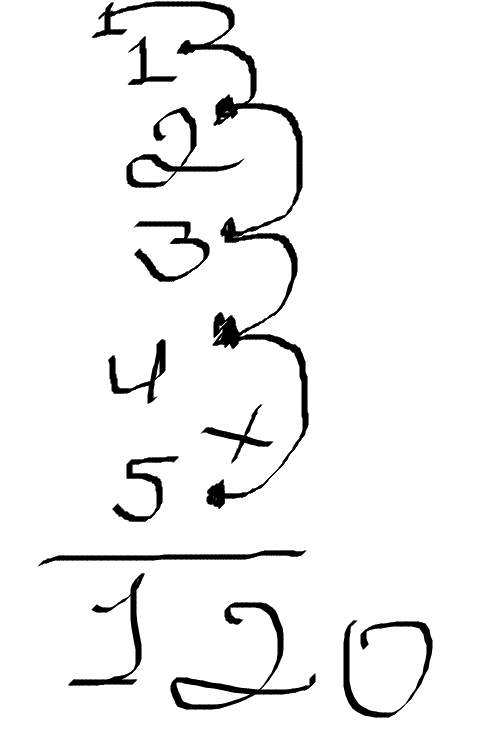
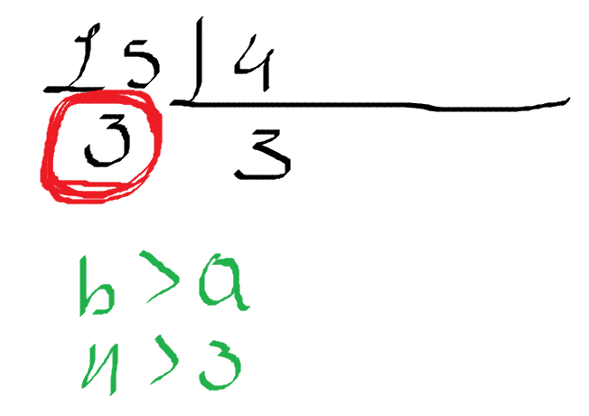
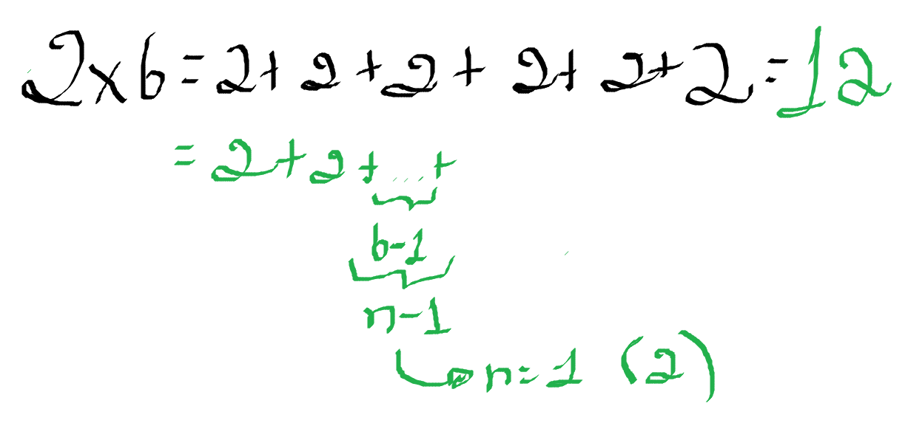
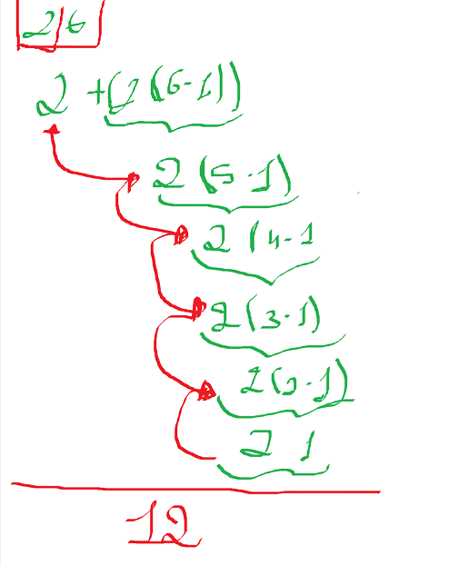
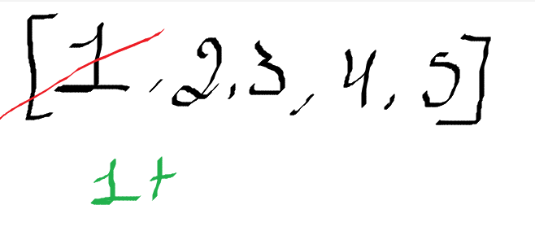
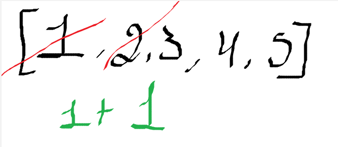
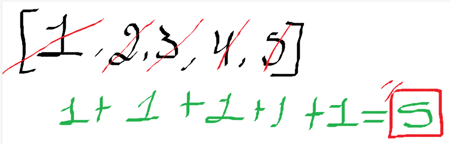

# O paradigma funcional
A fudamentação teorica desse estilo de programação é o cálculo Lambda ou cálculo-λ, proposto por Alonzo Church na década de 30, que é um sistema formal para a definição. A primeira linguagem de programação funcional foi Lisp, na decada de 50, porém, mais recentemente, precisamente em 1 de abril de 1990, surgiu uma linguagem puramente funcional, o Haskell, nomeada assim em homenagem ao lógico Haskell Curry, que foi o inventor do calculo lambda. Haskell vai além de uma linguagem puramente funcional, ela possui diversos recursos avançasods de programação.

# Primeiro contato com haskell
para somar números de 1 até n em linguagens não funcionais, ou seja, em algoritmos imperativos, fariamos da seguinte forma:
1. Ruby
```ruby
def soma_ate_n(n)
  soma = 0
  for i in 1..n
    soma += i
  end
  return soma
end
```

2. Python
```py
def soma_ate_n(n):
    soma = 0
    for i in range(n+1):
        soma += i
    return soma
```

3. JAVA
```java
public class SomaAteN {
    public static int somaAteN(int n) {
        int soma = 0;
        for (int i = 1; i <= n; i++) {
            soma += i;
        }
        return soma;
    }
```
Essas formas são apenas para exemplo e claramente poderiam ser melhoradas, mas vamos utilizar apenas como exemplificação.

Em haskell podriamos obter o mesmo resultado em apens uma linha de código, usando do seguinte algoritmo:

```haskell
soma n = sum [1 .. n]
```

Assim, consigmos chegar em algo parecido, mas lembre-se, programar em liguagem funcional é aprender a pensar de uma forma diferente.
Haskell é uma linguagem de programação fortemente tipada e estática. Isso significa que os tipos das variáveis são verificados em tempo de compilação e não podem ser alterados durante a execução do programa.

Em Haskell, cada expressão e cada valor tem um tipo definido e o compilador verifica se esses tipos são consistentes durante a compilação. Se houver algum erro de tipo, o compilador irá relatar um erro antes mesmo de executar o programa.

Por exemplo, se você tentar somar um número inteiro com uma string, o compilador de Haskell irá gerar um erro de tipo durante a compilação, pois não é possível somar um inteiro com uma string.

Essa abordagem de tipagem estática ajuda a detectar muitos erros de programação antes mesmo de executar o programa, tornando o código mais robusto e seguro

# Caracteristicas do haskell:

1. Programas concisos: Haskell é conhecido por permitir a escrita de programas concisos devido ao seu alto nível de abstração e à expressividade da linguagem. Isso significa que os desenvolvedores podem realizar tarefas complexas com menos linhas de código do que em outras linguagens.

2. Sistema de tipos poderoso: O sistema de tipos de Haskell é robusto e capaz de detectar uma ampla gama de erros de compatibilidade de tipos durante a compilação. Ele suporta polimorfismo e sobrecarga de funções, o que permite uma maior reutilização de código e flexibilidade na definição de tipos.

3. Compreensão de listas: Haskell oferece uma notação simples e poderosa para a construção e manipulação de listas, através do conceito de compreensão de listas. Isso permite aos desenvolvedores criar novas listas a partir de seleções e filtragens de elementos de listas existentes de forma concisa e elegante.

4. Funções de alta ordem: Em Haskell, as funções são tratadas como cidadãs de primeira classe, o que significa que elas podem ser passadas como parâmetros para outras funções e retornadas como resultados de outras funções. Isso possibilita a programação funcional de maneira elegante e eficaz.

5. Efeitos monádicos: Embora Haskell seja uma linguagem funcional pura, muitos programas precisam lidar com efeitos colaterais, como entrada/saída (I/O). O sistema de mônadas em Haskell oferece um mecanismo para lidar com esses efeitos colaterais de forma segura e sem comprometer a pureza das funções.

6. Avaliação preguiçosa: Haskell utiliza avaliação preguiçosa, o que significa que as expressões são avaliadas apenas quando seus resultados são realmente necessários. Isso permite trabalhar com estruturas de dados potencialmente infinitas e escrever código que seja mais eficiente em termos de uso de recursos.

7. Funcional: Haskell é uma linguagem funcional, o que significa que ela trata a computação como uma avaliação de funções matemáticas e evita o estado mutável e os efeitos colaterais comuns em linguagens imperativas.

8. Pura: Haskell é uma linguagem puramente funcional, o que implica que não há efeitos colaterais em suas funções. Cada função em Haskell, dada a mesma entrada, sempre retornará a mesma saída, sem causar alterações externas no ambiente.

9. Tipagem Estática: Haskell possui um sistema de tipos estáticos, o que significa que os tipos de todas as expressões em um programa são verificados durante a compilação. Isso ajuda a evitar muitos erros comuns de programação, antes mesmo que o código seja executado.

10. Inferência de Tipos: Embora Haskell seja fortemente tipado, ele possui um poderoso sistema de inferência de tipos. Isso significa que, na maioria dos casos, o compilador é capaz de deduzir os tipos das expressões sem a necessidade de declarações explícitas de tipo pelo programador.

11. Lazy Evaluation: Haskell utiliza avaliação preguiçosa (lazy evaluation), o que significa que as expressões não são avaliadas até que seus resultados sejam realmente necessários. Isso permite uma abordagem mais eficiente em termos de uso de recursos, já que apenas as partes necessárias de uma estrutura de dados são realmente computadas.

12. Imutabilidade: Haskell promove o uso de dados imutáveis, o que significa que uma vez que um valor é definido, ele não pode ser alterado. Isso facilita o raciocínio sobre o código e ajuda a evitar muitos tipos de bugs.

13. Expressividade: Devido à sua natureza funcional e à ênfase em funções de ordem superior, Haskell é uma linguagem muito expressiva. Isso permite que os desenvolvedores escrevam código de forma concisa e elegante.

14. Sistema de Módulos: Haskell possui um sistema de módulos robusto, que permite aos desenvolvedores organizar seus programas em unidades lógicas e reutilizáveis, facilitando a manutenção e o desenvolvimento de código modular.


# como instalar o haskell
Para instalr é mais simples do que você pensa, seguindo apenas os passos a passos do site oficial do haskell é possivel fazer o download. 
[Site oficial para download](https://www.haskell.org/ghcup/)


# Funções disponiveis já após ter ele instalado

head: Obtém o primeiro elemento de uma lista
```haskell
Prelude> head [1,2,3,4,5]
1
```

tail: Obtém a cauda da lista, i.e., a lista sem o seu primeiro elemento
```haskell
Prelude> tail [1,2,3,4,5]
[2,3,4,5]
```

!! (operador, utiliza notação infixa): seleciona o n-ésimo elemento de uma lista (iniciando em 0)
```haskell
Prelude> [1,2,3,4,5] !! 2
3
```

drop: remove os n primeiros elementos de uma lista
```haskell
Prelude> drop 2 [1,2,3,4,5]
[3,4,5]
```

take: Seleciona os n primeiros elementos de uma lista
```haskell
Prelude> take 2 [1,2,3,4,5]
[1,2]
```

length: Calcula a quantidade de elementos em uma lista
```haskell
Prelude> length [1,2,3,4,5]
5
```

sum: Calcula a soma de todos os elementos de uma lista de números
```haskell
Prelude> sum [1,2,3,4,5]
15
```

product: Calcula o produto de todos os elementos de uma lista de números
```haskell
Prelude> product [1,2,3,4,5]
120
```

++ (operador, utiliza notação infixa): Concatena duas listas
```haskell
Prelude> [1,2,3,4,5] ++ [6,7,8,9,10]
[1,2,3,4,5,6,7,8,9,10]
```

reverse: Inverte uma lista
```haskell
Prelude> reverse [1,2,3,4,5]
[5,4,3,2,1]
```

# Tipos em haskell

1. Inteiro (Int)
```haskell
x :: Int
x = 10
```

2. Flutuante (Double)
```haskell
piValue :: Double
piValue = 3.14
```

3. Caractere  (Char)
```haskell
firstLetter :: Char
firstLetter = 'A'
```

4. Booleano (Bool)
```haskell
logado :: Bool
logado = True
```

5. String (String)
```haskell
nome :: String 
nome = "Jeová"
```

6. Lista (List)
```haskell
numbers :: [Int]
numbers = [1, 2, 3, 4, 5]

chars :: [Char]
chars = ['a', 'b', 'c', 'd', 'e']
```

7. Tupla (Tuple):
```haskell
person :: (String, Int)
person = ("Alice", 30)
```

8. Função:
```haskell
add :: Int -> Int -> Int
add x y = x + y
```


# indentação significativa
Em Haskell, o layout, também conhecido como "indentação significativa", é uma característica fundamental da sintaxe da linguagem. Ao contrário de outras linguagens de programação que usam chaves {} ou palavras-chave como begin e end para delimitar blocos de código, em Haskell, a estruturação do código é determinada pela indentação.
Aqui estão as regras básicas do layout em Haskell:

- Indentação: Blocos de código devem ser indentados de maneira consistente, usando espaços ou tabulações. Não é permitido misturar espaços e tabulações.

- Nível de Indentação: Blocos de código aninhados devem ter níveis de indentação crescentes.

- Alinhamento: As linhas dentro do mesmo bloco de código devem estar alinhadas verticalmente.

- Início de Blocos: O início de um bloco de código é indicado pela indentação maior em relação à linha anterior.

- Fim de Blocos: O fim de um bloco de código é indicado pelo retorno ao nível de indentação anterior ou por um novo bloco de código com uma indentação menor.

- Obrigação de Layout: Embora o layout seja uma parte importante da sintaxe em Haskell, você também pode usar chaves {} para delimitar blocos de código se preferir.

obs: Em Halkell para comentarmos alguma parte do código usamos: 
```haskell 
-- aqui é um comentario em haskell
```

Exemplo de indentação significativa
```haskell
-- Definição de uma função para verificar se um número é positivo, negativo ou zero
verificarNumero :: Int -> String
verificarNumero n | n > 0     = "O número é positivo"
                  | n < 0     = "O número é negativo"
                  | otherwise = "O número é zero"

-- Função principal
main :: IO ()
main = do
    putStrLn "Digite um número:"
    input <- getLine
    let numero = read input :: Int
    putStrLn $ verificarNumero numero
```


# Definição de função em Haskell
Em Haskell, a sintaxe básica para definir uma função é bastante simples e segue o padrão:

```haskell
nomeDaFuncao :: TipoDoArgumento1 -> TipoDoArgumento2 -> ... -> TipoDoResultado
nomeDaFuncao argumento1 argumento2 ... = expressao
```

```haskell
soma :: Int -> Int -> Int
soma x y = x + y
```

# Condicionais
Em Haskell, você pode usar expressões condicionais para realizar diferentes ações com base em condições. Existem duas principais maneiras de fazer isso: usando a expressão if-then-else e usando padrões de correspondência.

1. Expressão if-then-else
```haskell
if condição then expressão1 else expressão2
```

2. Implementando
```haskell
positivoOuNegativo :: Int -> String
positivoOuNegativo x =
    if x >= 0
        then "positivo"
        else "negativo"
```

3. Outra forma de implementar usando guarda em Haskell
```haskell
positivoOuNegativo :: Int -> String
positivoOuNegativo x
    | x >= 0    = "positivo"
    | otherwise = "negativo"
```

# Guardas
As guardas são uma maneira de expressar condicionais em definições de função, permitindo avaliar diferentes expressões com base em condições booleanas.
Aqui está um exemplo de como você pode usar guardas em Haskell:
```haskell
positivoOuNegativo :: Int -> String
positivoOuNegativo x
    | x > 0     = "positivo"
    | x < 0     = "negativo"
    | otherwise = "zero"
``` 

# Listas em Haskell
Em Haskell, as listas são uma estrutura de dados fundamental e extremamente versátil. Elas são usadas para armazenar sequências de elementos do mesmo tipo. Aqui estão algumas operações comuns que você podemos utilizar em haskell:

1. Criando uma lista de Int em haskell
```haskell
minhaLista :: [Int]
minhaLista = [1, 2, 3, 4, 5]
```

2. Criando uma lista de Char em haskell
```haskell
outraLista :: [Char]
outraLista = 'a' : 'b' : 'c' : []
```
3. Operações comuns de lista:
    Existem muitas funções predefinidas em Haskell que operam em listas. Aqui estão alguns exemplos:

- head: Retorna o primeiro elemento da lista.
- tail: Retorna todos os elementos da lista, exceto o primeiro.
- length: Retorna o tamanho (número de elementos) da lista.
- null: Verifica se a lista está vazia.
- everse: Inverte a ordem dos elementos na lista.
- take: Retorna os primeiros n elementos da lista.
- drop: Remove os primeiros n elementos da lista.
- map: Aplica uma função a cada elemento da lista.
- filter: Retorna uma lista contendo apenas os elementos que satisfazem um predicado.


# where 
A palavra-chave where em Haskell é usada para definir variáveis locais dentro de uma função, permitindo que você organize o código de uma maneira mais clara e legível. A cláusula where é colocada no final da definição de uma função e é usada para fornecer definições locais que são usadas apenas dentro dessa função específica.

```haskell
quadradoMaisCubo :: Int -> Int -> Int
quadradoMaisCubo x y = quadrado + cubo
    where
        quadrado = x ^ 2
        cubo = y ^ 3
```

# Comprensão de listas
A compreensão de listas, também conhecida como "list comprehension" em inglês, é uma construção poderosa em Haskell (e em várias outras linguagens funcionais) que permite criar novas listas de maneira concisa e expressiva, aplicando transformações e filtros a uma lista existente. Ela segue uma sintaxe simples e intuitiva, facilitando a criação de listas complexas de forma elegante.

A sintaxe geral de uma compreensão de lista em Haskell é a seguinte:
```haskell
[expressão | gerador1, gerador2, ..., geradorN, condição1, condição2, ..., condiçãoM]
```
- expressão: A expressão que será avaliada para cada elemento da lista resultante.
- gerador: Define como os elementos são gerados. Pode ser uma ligação de variável (x <- lista) ou uma tupla de ligações de variável ((x, y) <- lista).
- condição: Uma condição opcional que os elementos gerados devem satisfazer.

Aqui está um exemplo simples de compreensão de lista em Haskell:
```haskell
pares :: [Int]
pares = [x | x <- [1..10], even x]
```
ou
```haskell
pares :: [Int]
pares = [x | x <- [1..10], x `mod` 2 == 0]
```

# Recursividade

- Recursão, ou recursividade, é um conceito fundamental na programação que se refere à capacidade de uma função chamar a si mesma, direta ou indiretamente. Em outras palavras, uma função recursiva é uma função que se define em termos de si mesma. Quando uma função é chamada, ela executa um conjunto de instruções e, em seguida, pode chamar a si mesma para realizar uma parte da tarefa. Isso continua até que uma condição de parada seja atendida, momento em que a função começa a retornar valores para cada chamada recursiva, permitindo que as chamadas se desenrolem e a execução seja concluída. A recursão é comumente usada em algoritmos que podem ser naturalmente definidos em termos de casos menores do mesmo problema. Exemplos clássicos incluem o cálculo de fatorial, a sequência de Fibonacci, a busca em árvores, entre outros.

Um exemplo simples de função recursiva em Haskell para calcular o fatorial de um número é:
```haskell
fatorial :: Int -> Int 
fatorial n
    | n == 0 = 1
    | n > 0 = n * fatorial (n-1)

main :: IO()
main = do
    print (fatorial 5)
```

como fuciona em forma de desenho a cada interação na recursividade, onde o numero usando como exemplo foi o fatorial de 5, que a cada recursão ele perde um (n-1) e vai ficando a baixo da pilha de chamadas, que ao final ele retorna 1 quando for 0 (n == 0 = 1) e vai ultiplicando os valores de cima para baixo até chegar ao valor inicial, que no nosso caso foi 5.

``` markdown
1. fatorial(5) - Retorna 5 * 24 (120)
2. fatorial(4) - Retorna 4 * 6 (24)
3. fatorial(3) - Retorna 3 * 2 (6)
4. fatorial(2) - Retorna 2 * 1 (2)
5. fatorial(1) - Retorna 1 * 1 (1)
6. fatorial(0) - Retorna 1
```

</br>



---

- Outro exemplo é para encontrar o resto da divisão entre dois números

``` haskell
divrec :: Int -> Int -> Int
divrec a b 
    | b > a = a
    | b == a = 0
    | otherwise = divrec(a - b) b

main :: IO()
main = do
    print (divrec 15 4)
```
</br>



---

- multiplicacao usando soma por meio da recursividade 

``` haskell
multirecursiva :: Int -> Int -> Int
multirecursiva a b
    | b == 1 = a 
    | otherwise = a + multirecursiva a (b-1)

main :: IO()
main = do
    print (multirecursiva 10 7)
```

 


# Recrusão em calda 
- Recursão em cauda (ou tail recursion, em inglês) é um conceito importante em programação funcional. É uma forma específica de recursão em que a chamada recursiva é a última operação realizada pela função antes de retornar um valor. Em outras palavras, o resultado da chamada recursiva é imediatamente passado de volta como resultado da função, sem a necessidade de fazer mais nenhum cálculo. Isso é particularmente relevante porque, em algumas linguagens de programação, como Haskell, a recursão em cauda pode ser otimizada pelo compilador para evitar estouro de pilha, já que não é necessário manter um registro das chamadas recursivas anteriores.Para que uma função seja recursiva em cauda, a chamada recursiva deve ser a última coisa que ela faz antes de retornar. Isso geralmente significa que a chamada recursiva deve ser usada como argumento de retorno da função, ou seja, ela deve ser a "cauda" da definição da função
```haskell
fatorialCauda :: Int -> Int -> Int
fatorialCauda x acumulado
    | x == 0 = acumulado
    | x > 0 = fatorialCauda (x-1) (x * acumulado)

main :: IO()
main = do
    print (fatorialCauda 5 1)
```
A chamada recursiva fatorialCauda (x-1) (x * acumulado) é a última coisa que a função faz antes de retornar, o que torna essa função um exemplo de recursão em cauda. Isso permite que ela seja otimizada para uma forma iterativa eficiente, evitando assim estouro de pilha.


- Listas 
Em Haskell, uma lista é uma estrutura de dados fundamental e extremamente flexível. Elas podem ser homogêneas (ou seja, todos os elementos têm o mesmo tipo) e são construídas recursivamente. Uma lista é uma coleção ordenada de elementos do mesmo tipo. A sintaxe básica para uma lista em Haskell é colocar os elementos entre colchetes e separá-los por vírgulas

Há algumas formas comuns de trabalhar com listas em Haskell:

1. Acesso aos elementos da lista:
- head: Retorna o primeiro elemento da lista.
- last: Retorna o último elemento da lista.
- !!: Retorna o elemento de índice específico da lista.

2. Operações básicas:

- ++: Concatena duas listas.
- : (cons): Adiciona um elemento ao início de uma lista.
- null: Verifica se uma lista está vazia.
- length: Retorna o tamanho de uma lista.

3. Operações de manipulação:

- map: Aplica uma função a cada elemento da lista, produzindo uma nova lista com os resultados.
- filter: Retorna uma lista contendo apenas os elementos que satisfazem um predicado.

4. Operações de geração de listas:

- [start..end]: Gera uma lista de valores a partir de start até end.
-  [start, increment..end]: Gera uma lista de valores a partir de start, com um incremento específico, até end.

5. Recursão em listas:

- A recursão é uma técnica comum para processar listas em Haskell. Funções frequentemente são definidas utilizando recursão para processar elementos de uma lista.

Listas em Haskell são imutáveis, o que significa que não podem ser modificadas após serem criadas. No entanto, você pode criar novas listas a partir de listas existentes, aplicando operações ou funções a elas.
Esses são apenas alguns dos conceitos básicos sobre listas em Haskell. Elas são uma parte central e poderosa da linguagem e são amplamente utilizadas em muitos programas Haskell.

- Exemplo de codigo em haskell que usa recursão e listas para calcular o tamanho de uma lista me haskell 
``` haskell 
comp :: [Int] -> Int
comp [] = 0
comp (h:t) = 1 + comp t

main :: IO()
main = do
    print(comp [1, 2, 3, 4, 5])
```
como funciona o algoritmo:








como observado a medida que vai passando a recursão, vai cortando sempre o elemento da cabeça (head -- h) e vai sempre passando a calda para a proxima interação e com isso vai incrementando + 1 na recursão, que ao final, quando tiver 0 elementos ele retona toda a soma dessa interação.